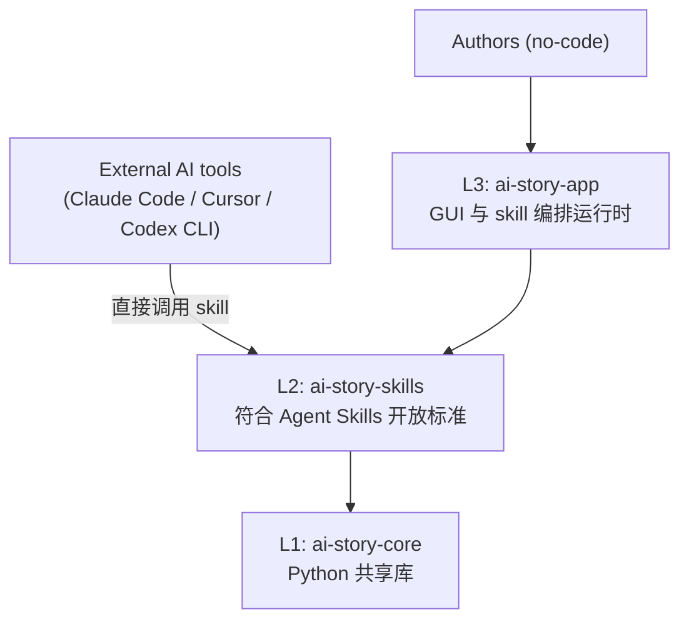
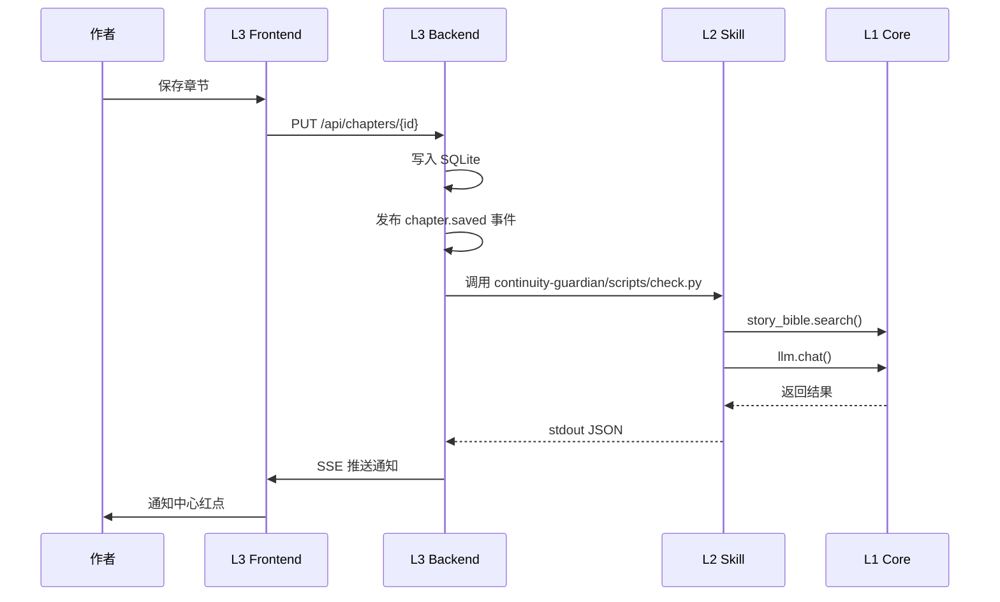

# AI-Story Architecture

> **本文是 AI-Story 的宪法文件。任何代码改动都不得违反这里定义的边界。**
>
> 任何 AI Coding 助手（DeepSeek V4 Pro / Copilot / Cursor / Claude Code 等）在开始任务前必须先读完本文件。
>
> 当前版本：v1.0  
> 修订日期：2026-05-16

## 1. 一句话定位

AI-Story 是面向小说创作者的 **Open Agent Skills 套件 + 配套运行时**。

它不是一个 monolithic 写作 app，而是三层结构，每一层可以独立使用、独立部署、独立演进。

## 2. 三层架构总览



| 层 | 名称 | 形态 | 主要使用者 | 必须依赖 |
|---|---|---|---|---|
| L1 | `ai-story-core` | Python 包（PyPI） | skill 作者、L3 后端 | 无 |
| L2 | `ai-story-skills` | SKILL.md 集合 | Claude Code / Cursor 用户、L3 | L1 |
| L3 | `ai-story-app` | Tauri 桌面 app + Web UI | 不写代码的小说作者 | L1 + L2 |

**核心约束**：依赖只能向下，绝不向上。L1 不知道 L2 存在；L2 不知道 L3 存在。

## 3. 各层职责详解

### L1：ai-story-core

**定位**：纯 Python 共享库。所有"和小说创作有关、可能被多处复用的能力"都在这里。

**包含**：

- `story_bible`：读写 `.aistory/bible.json`，提供 CRUD、查询、锁定、置信度等 API
- `rag`：本地向量检索（默认 ChromaDB），用于知识库片段召回
- `llm`：统一 LLM 客户端，支持 OpenAI / Anthropic / DeepSeek / Ollama 切换，封装 JSON 输出、重试、token 计数
- `schemas`：所有跨层共享的 Pydantic 类型（Memory、StoryBibleEntry、Chapter、Issue 等）
- `utils`：通用工具（脱敏、token 估算、文件锁等）

**禁止包含**：

- ❌ 任何 web 框架（FastAPI / Flask / Django）
- ❌ 任何前端框架（React / Vue）
- ❌ 数据库 ORM（不预设 SQLAlchemy）
- ❌ 任何 skill 业务逻辑（一致性检查的 prompt 不在这里）

**接口稳定性**：1.0 之前所有 API 都可能变。1.0 之后遵循 SemVer。

### L2：ai-story-skills

**定位**：符合 Anthropic Agent Skills 开放标准的 skill 集合。每个 skill 是一个独立目录。

**目录结构**：

```
skills/
  continuity-guardian/
    SKILL.md
    scripts/
      check.py
    resources/
      severity-rubric.md
  story-bible-curator/
    SKILL.md
    scripts/
      extract.py
  character-interview/
    SKILL.md
    scripts/
      interview.py
  anti-ai-slop-detector/
    SKILL.md
    scripts/
      detect.py
    resources/
      slop-patterns.md
```

**每个 skill 必须**：

- 根目录有 `SKILL.md`，YAML frontmatter 包含 `name` 和 `description`
- `description` 单一职责、具体明确、能直接被 AI 模型用于路由判断
- 业务逻辑在 `scripts/` 下，纯 Python，通过 `import ai_story_core` 调用 L1 能力
- 输出严格 JSON 并用 Pydantic schema 校验，无法判断时返回空数组或 `confidence: 0`，不要编造
- 不直接读写 SQLite，统一通过 `ai_story_core.story_bible` 模块读写 `.aistory/bible.json`
- 不依赖 `app/backend` 的任何 FastAPI 路由——skill 必须能在用户没运行 backend 时独立工作

**详细规范**：见 `SKILL_AUTHORING_GUIDE.md`（待补充）。

### L3：ai-story-app

**定位**：可视化运行时，给非技术用户使用。

**包含**：

- `app/frontend/`：React 18 + TypeScript + Vite。负责 UI、可视化、编辑器
- `app/backend/`：FastAPI + SQLAlchemy + SQLite。负责文件管理、skill 编排、设置面板、事件总线
- 未来：Tauri 打包，一键安装的桌面 app

**核心职责**：

1. 编排 skill（事件总线、任务队列、并行调度）
2. 可视化展示 Story Bible / Chapters / Memories
3. 文件 / 项目管理（创建 / 切换 / 导入 / 导出）
4. 设置（API Key、provider 切换、token 预算）
5. 通知中心（agent 后台输出的提示和建议）

**关键约束**：

- App 不应承担"原子 AI 任务"。每个 AI 动作都应该是调用某个 skill，而不是 app 自己写 prompt
- 现有 `app/backend/app/services/` 下的 service（如 `consistency_service`、`story_bible_service`）逐步重构：把 prompt 和 AI 调用部分迁移到 skill，把数据存储部分迁移到 core
- 重构是渐进的，不要一次性大改

## 4. 数据流：典型场景

**场景**：作者写完一章，按 Ctrl+S。



**同一个 skill 在 Claude Code 中工作**：

1. 用户在 Claude Code 里说"检查这一章有没有冲突"
2. Claude 根据 `description` 自动路由到 `continuity-guardian` skill
3. Skill 内部同样 `import ai_story_core`，调用 `story_bible.search()`（读的是当前目录下的 `.aistory/bible.json`）
4. Skill 输出 JSON
5. Claude Code 把结果展示给用户

**关键**：步骤 5 之前两条路径是同一份代码。这就是三层架构的价值。

## 5. 存储模型

**默认路径**：当前小说项目根目录下的 `.aistory/` 文件夹。

**主要文件**：

- `.aistory/bible.json` — Story Bible 结构化设定主数据
- `.aistory/memories.json` — 项目记忆
- `.aistory/chapters/` — 章节正文（每章一个 .md 文件）
- `.aistory/index/` — 向量索引（ChromaDB 持久化目录）
- `.aistory/notifications.json` — agent 异步产出的待处理通知

**约束**：

- 所有 skill 和 app 都通过 `ai_story_core.story_bible` 等模块读写这些文件，不直接操作 JSON
- 文件格式公开、稳定，作者可以脱离 AI-Story 用任何编辑器查看修改
- 详细 schema 见 `OPEN_STORY_BIBLE_FORMAT.md`（待补充）

## 6. 部署形态

| 用户类型 | 安装内容 | 工作方式 |
|---|---|---|
| Skill 高级用户 | `pip install ai-story-core` + 把 skill 目录 `cp` 到 `~/.claude/skills/` | 在自己的 Claude Code / Cursor / Codex 里用 |
| 作者用户 | 下载 AI-Story 桌面 app（自带 core 和所有官方 skill） | 双击运行，图形界面操作 |
| 开发者贡献者 | 完整 clone 仓库 | 三层都能本地跑 |

## 7. 本项目 NOT 是什么

为了避免功能漂移：

- ❌ 不是另一个 NovelCrafter 开源克隆
- ❌ 不是全自动小说生成器（autonovel 走那条路）
- ❌ 不是 Story Bible 单机管理工具（已有大量竞品）
- ❌ 不会自己做 LLM provider 或 inference 服务
- ❌ 不卖订阅、不做 SaaS、不做云端账户系统
- ❌ 不替代作者写作判断，只做检查、提取、提示

## 8. 术语表

| 术语 | 定义 |
|---|---|
| Skill | 符合 SKILL.md 标准的独立 AI 能力单元 |
| Core | `ai-story-core` Python 包 |
| App | `ai-story-app`，即 L3 GUI |
| Bundle | 一组打包发布的 skill 集合 |
| Story Bible | 项目的结构化设定数据 |
| Anchor file | `.aistory/bible.json`，公开 schema 的主数据文件 |
| OSBF | Open Story Bible Format，本项目定义的 bible 数据标准 |

## 9. 修改本文件的规则

ARCHITECTURE.md 是宪法。修改必须满足：

- 由项目所有者明确批准
- AI Coding 助手不得未经允许修改本文件
- 每次修改要更新版本号和修订日期
- 修改如果影响到 .clinerules / SKILL_AUTHORING_GUIDE.md / OPEN_STORY_BIBLE_FORMAT.md，必须同步更新这些下游文件
